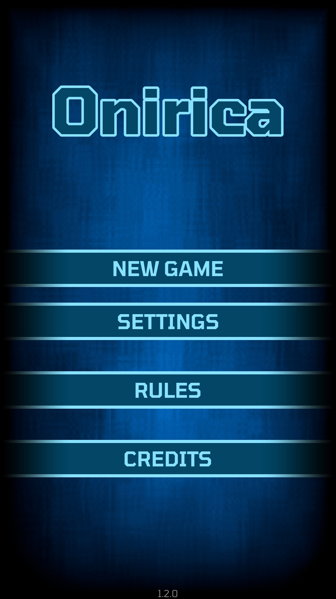
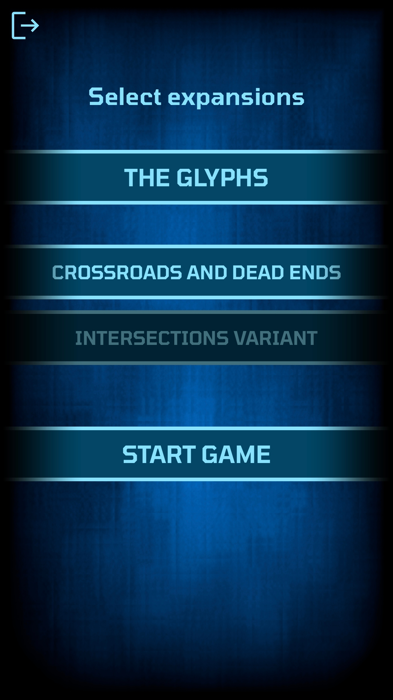
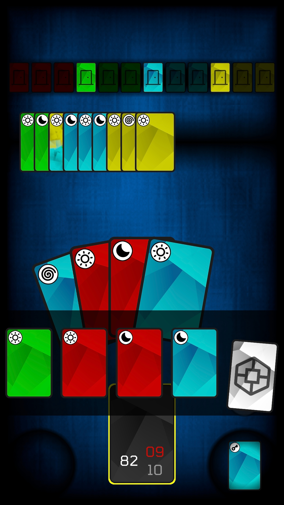
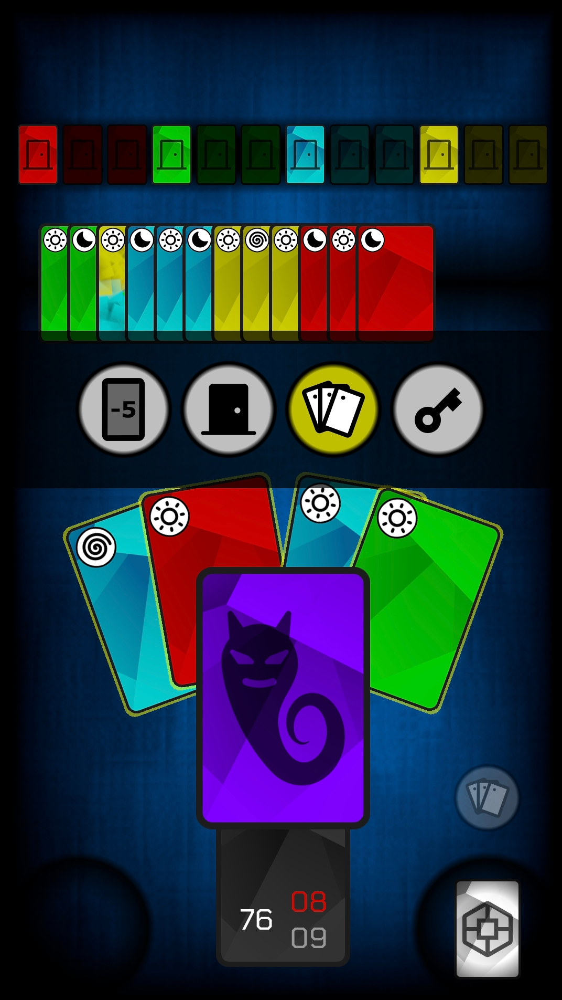
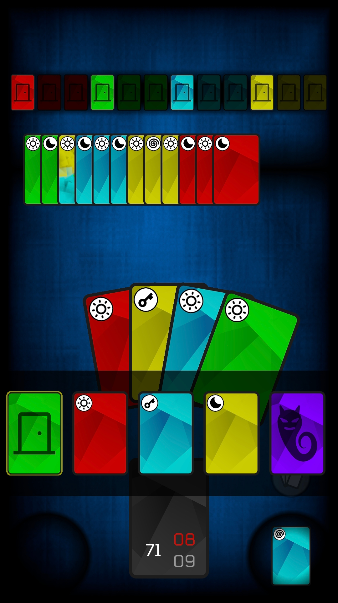
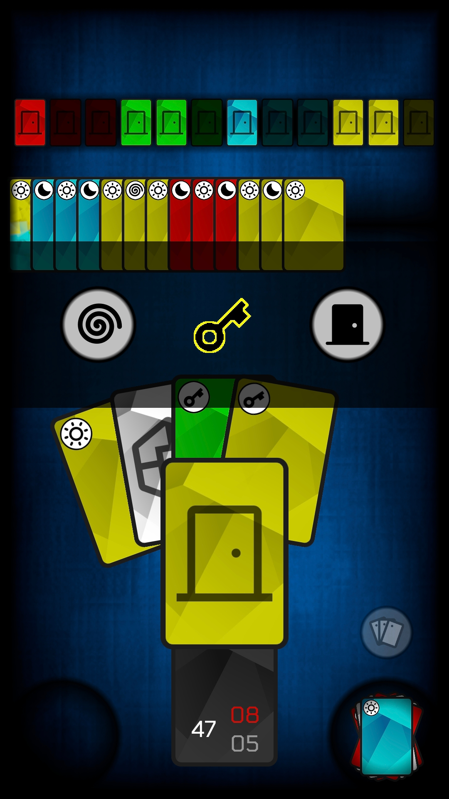
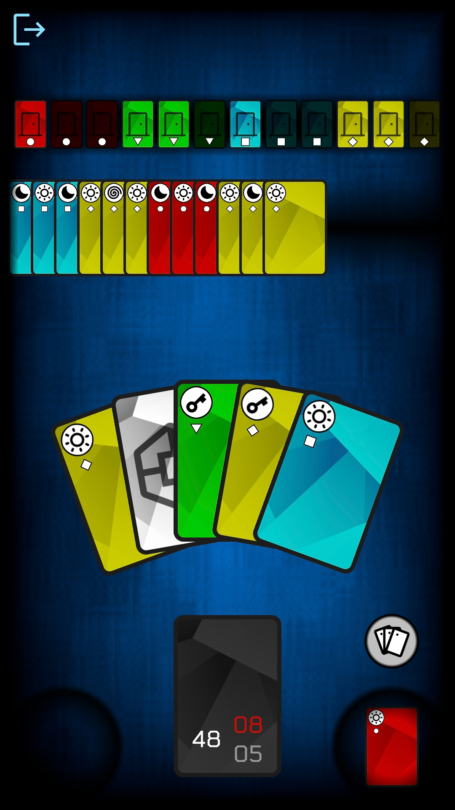

# Onirica

Onirica is an unofficial (and partial) implementation of the card game Onirim by Shadi Torbey.

## Features:
- Base game
- The Glyphs expansion
- Crossroads and dead ends expansion
- Color blind friendly
- Free and no-ads forever

[Available on Android](https://play.google.com/store/apps/details?id=eu.flatworld.onirica)

[Available on itch.io](https://flatworld.itch.io/onirica)

## Notes
The original game includes more ways to play, more expansions and beautiful artwork.
You should definitely consider to buy it.
More informations can be found here:

[Onirim on BoardGameGeek](https://boardgamegeek.com/boardgame/156336/onirim-second-edition)

[Onirim on inPatience](https://inpatience.com/en/Our_Games-7-ONIRIM)

***This project has no connection with the designer and the publishers of the original game.***

## Screenshots
<table>
  <tr>
    <td></td>
    <td></td>
    <td></td>
    <td></td>
  </tr>
  <tr>
    <td></td>
    <td></td>
    <td></td>
  </tr>
</table>
